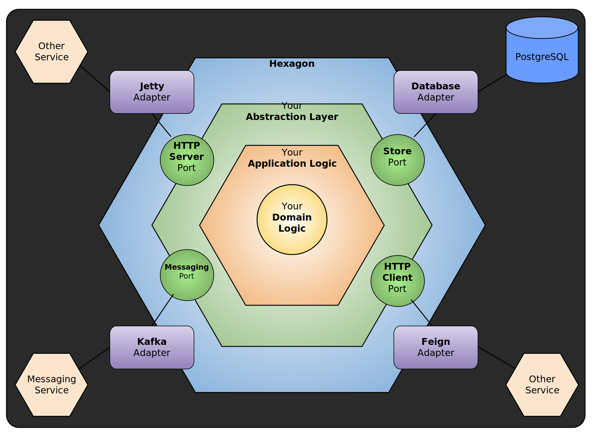

# Microlith

A foundational project for any technology venture

## What is it?

A kotlin-based Spring Boot application using Reactive webflux APIs. 
The project uses a hexagonal architecture, along with 
[DDD](https://en.wikipedia.org/wiki/Domain-driven_design) 
principals to create a clean design that helps enforce good programming practice.

Microlith is essentially a microservice architecture designed and intended to be deployed as a monolith. 
There is an operational complexity that comes with a microservices architecture. One can argue that
microservices are a solution to a people problem, rather than something that arose due to an inherent
technical problem. Put simply, there is a point at which the number of people working in a monolith
becomes unwieldy.

**This project is intended for smaller teams that don't want to take on the operational complexities
that come with microservices, but do want to benefit from the microservice advantages.**

One of the primary benefits of microservices is that
it forces an organization to think deeply about the business domain, and how to split it. In the parlance
of DDD, each microservice typically contains a single Bounded Context which addresses a specific 
area of concern for the business. 

Microservices contain various mechanisms to communicate with each other. In order to allow for this, 
patterns have emerged. In essence, each microservice
defines a contract for how other services can speak to it.

In Microlith, we've created an architecture that simulates the communication by contract that separates, 
but relates each separate microservice (or Bounded Context). Every Bounded Context is packaged in its own
maven artifact. This gives us compile time isolation, but we can go further. At runtime, each Bounded Context
runs in its own Spring Application Context. 

What this does is to give us an application architecture that attempts to combine the best of both
monolithic and microservice architectures.

## Why?

Writing high quality server-side software applications that stand the test of time
is a hard problem. Over time, applications become increasingly complex and suffer from a variety of 
problems, some of which are outlined below.

As illustrated in Figure 1, there are a bevy of concerns, across multiple dimensions that 
software engineers must be mindful of at all times. 

High quality software addresses most, if not all, of these. A good software architecture
will either solve these concerns, make it difficult to violate them, or at the very
least guide the software engineer to produce high quality software.


(Figure 1)

## Some Problems With Traditional Layered Architectures

Traditionally, Spring Boot applications use a layered architecture that looks something like this:

| Spring Boot Application Layers    |
|-----------------------------------|
| Web - Controllers                 |
| Domain - Business Logic           |
| Persistence - Data Access Objects |

Nothing is inherently wrong with this, but a layered architecture has too many 
open flanks that allow bad habits to creep in and make the software increasingly 
harder to modify over time.

Here are just some of the problems that arise:

* **It promotes DB-driven design**
    * By its very definition, the foundation of a conventional layered architecture is the database.
    * This creates a strong coupling between the persistence layer, the domain layer, and often the web layer as well.
    * The persistence code is virtually fused into the domain code, thus it’s hard to change 
      one without the other. That’s the opposite of being flexible and keeping options open.
* **It's prone to shortcuts**
    * The only global rule is that from a certain layer, we can only access components in the same layer or a layer 
below
    * if we need access to a certain component in a layer above ours, we can just push the component down a layer and 
we’re allowed to access it. 
      Problem solved? Over time, the persistence layer will grow fat as we push components down through the layers.
* **It grows hard to test**
    * A common evolution within a layered architecture is that layers are being skipped. We access the persistence 
layer directly from the web layer.
    * We’re implementing domain logic in the web layer, even if it’s only manipulating a single field. 
What if the use case expands in the future?
    * In the tests of our web layer, we not only have to mock away the domain layer, but also the persistence layer.
* **It hides the use cases**
    * In a layered architecture it easily happens that domain logic is scattered throughout the layers.
    * A layered architecture does not impose rules on the “width” of domain services. Over time, this often leads 
to very broad services that serve multiple use cases.
    * A broad service often has MANY dependencies on other Spring beans from the context, at varying layers.
    * A broad service is also often used by many components in the web layer.
    * The end result is ["The Big Ball of Mud"](https://en.wikipedia.org/wiki/Big_ball_of_mud).
* **It makes parallel work difficult**
    * Working on different use cases will cause the same service to be edited in parallel which leads to merge 
conflicts and potentially regressions.

## The Microlith Architecture

The architecture of this project, although still a Spring Boot application, takes a different approach.
None of the individual ideas implemented in this project are new, but the way in which these ideas are combined into
a single architecture is new.

All the following concepts dovetail together in an elegant way, working in concert to provide for a powerful system
architecture. Here is a high level overview of each of the major the design elements of this architecture:

1. [Kotlin](https://kotlinlang.org/docs/home.html)
   - The use of kotlin was a strategic choice. This language provides a number of capabilities not available to Java
   without which this architecture would not be possible.
   - Specifically, the features of kotlin that are heavily leveraged:
     - Coroutines
     - Support for algebraic data types and exhaustive pattern matching
     - Functional Programming support
2. [DDD](https://en.wikipedia.org/wiki/Domain-driven_design)  - Domain Driven Design
   - Not limited to just a set of human procesess for requirements discovery, the output of those
   processes translates directly into the design of the domain of the system
   - In `microlith`, each [Bounded Context](https://martinfowler.com/bliki/BoundedContext.html) is isolated at compile 
   time by packing them in maven artifacts.
   - In addition to this, each Bounded Context is isolated at runtime as well. Each runs in its own Spring Application
   Context.
3. [CQRS](https://martinfowler.com/bliki/CQRS.html) - Command Query Response Segregation
   - Inspired by: https://medium.com/swlh/cqrs-and-application-pipelines-in-kotlin-441d8f7fe427
   - By separating out how Queries (reading data) of the system are performed from the Commands (writing data),
   we can optimize for each independently.
   - This mechanism also provides the mechanism for how a workflow in one Bounded Context can communicate with 
   another Bounded Context.
4. [Hexagonal Architecture](https://alistair.cockburn.us/hexagonal-architecture/)
   - Also knows as a Ports and Adapters architecture
   - An alternative to the 3-layer pancake architecture, this inverts the dependencies so that the domain of the
   application sits at the center, and depends on nothing. 
   - More on this below.
5. [Algebraic Data Types (ADTs)](https://itnext.io/an-introduction-to-algebraic-data-types-9429e49eac27)
    - An alternative to the traditional use of Object Oriented (OO) techniques to model a domain.
    - The gist is that these allow you to move business invariants from runtime checks to the type system, the effect
    of which is to move runtime errors to compile time errors. A huge win.
    - They also inherently provide state machines for each domain in your system
    - These are enabled by kotlin natively, along with exhaustive pattern matching and destructuring
    - These objects are immutable, which lend themselves to
6. [Functional Programming (FP)](https://alvinalexander.com/scala/fp-book/benefits-of-functional-programming/)
    - Follow the link for a brief outline of the benefits
    - This project introduces the concept of a `Workflow`. This is a generalized form of what you might call a 
   "Use Case". There is a 1:1 relationship between each API (e.g. Controller method) and a `Workflow`.
    - Every `Workflow` is kicked off with either a `Command` or `Query` (see: CQRS), and results in an `Event`.
    - `Workflow` never throws exceptions. Instead, the result of the workflow execution is contained in a discriminated
   union type containing either the desired `Event` output, or an `Error` type.
    - FP concepts extend beyond just the `Workflow` concept, and are embodied throughout.
7. [Asynchronous / Non-Blocking](https://blog.allegro.tech/2020/02/webflux-and-coroutines.html)
    - This project makes use of Spring Webflux, elegantly combined with 
   [Kotlin Coroutines](https://kotlinlang.org/docs/coroutines-guide.html).
    - A given server can handle a much higher request volume because requests aren't bound to threads, as they are in
   traditional servers.
    - Coroutine support is weaved throughout such that every operation that's performed, from each web request down
   to each database call are all performed using non-blocking operations.
    - Coroutines are a mechanism that makes parallel programming easy, even fun. In Java, you are forced to use
   primitives (e.g. Thread) that are exceedingly hard to get correct. 
8. [Event Driven](https://en.wikipedia.org/wiki/Event-driven_architecture)
   - Direct relation to DDD, which defines a system by its Events.
   - Events generated by each workflow, are published using Spring's event system.
   - As an example, domain objects are packaged in events, and sent to the event system. Event listeners in the 
   database Adapters translated these into DB Entities for storage. The logic that persists the system state changes
   is decoupled from the business logic that generated those changes. This reduces a rather large class of bugs.
   
### Hexagonal Architecture to the rescue



* This project was inspired by: https://reflectoring.io/spring-hexagonal/
* Lots more about hexagonal architecture: https://blog.octo.com/en/hexagonal-architecture-three-principles-and-an-implementation-example/


### `microlith` bounded context layout

```yml
user: Name of your bounded context (in this case, "user")
  domain: The core. Depends on nothing. All Business Logic. Built using ADTs
  adapter: Adapters connect to outside systems
    in: Input adapters "drive" the system, causing the system to act
      web: Typically Spring Controllers 
    out: Output adapters are "driven" by the system
      persistence: Typically DB Entity classes and DAOs (e.g. Spring Repositories)
  application: Comprised of Ports and Workflows, these define the interface to our app.
    workflows: Workflows with defined input/output types
    port: Allows communication between the app core and the adapters
      in: Defines Commands/Events for "driving" operations
      out: Typically interfaces called by the core for "driven" operations
```

### How does this layout help build maintainable software?

Name it Clean Architecture, Hexagonal Architecture or Ports and Adapters Architecture - 
by inverting our dependencies so that the domain code has no dependencies to the outside 
we can decouple our domain logic from all those persistence and UI specific problems 
and reduce the number of reasons to change throughout the codebase. And fewer reasons 
to change means better maintainability.

The domain code is free to be modelled as best fits the business problems while 
the persistence and UI code are free to be modelled as best fits the persistence 
and UI problems.

## Guidelines on how to use this project

The architecture closely follows a template outlined in 
[Get Your Hands Dirty on Clean Architecture](https://leanpub.com/get-your-hands-dirty-on-clean-architecture) 
with some notable changes, outlined here

1. **Create a new maven module for any new bounded context**
   
    Out of the box, a `User` bounded context is created for you that includes basic registration 
    and login capability. This module also forms a pattern for any new bounded context.
    
1. **The Domain should be built using Algebraic Data Types**

    More on this below, but for now read these very carefully:

    1. See: https://www.47deg.com/blog/functional-domain-modeling/
    2. See: https://www.47deg.com/blog/functional-domain-modeling-part-2/
    3. See: https://medium.com/rocket-fuel/kotlin-by-class-delegation-favor-composition-over-inheritance-a1b97fecd839
    
1. **Enforce Architecture with ArchUnit**

    This project enforces that the structure of each bounded context strictly enforces the purity
    of the hexagonal architecture through the use of ArchUnit testing. Specifically, it ensures
    that classes cannot import classes from other packages that it **should NOT** have access to.
    
## Algebraic Data Types (ADTs) in Microlith

It's always preferable to have compile time issues rather than runtime errors. With the use
of Algebraic Data Types (ADTs) we can do just that. The effect is to move your business invariants
from run-time to compile-time checks. Consider the following.

```java
// Java
class LibraryBook {
    String title;
    CheckoutStatus status; // Available, CheckedOut, Overdue
    Date dueDate;
}

class BookService {
    public LibraryBook checkoutBook(LibraryBook book) {
        if (CheckoutStatus.Available != book.getStatus()) {
            throw Exception();
        }
        book.setStatus(CheckoutStatus.CheckedOut);
        // ...
    }
}
```

Versus

```kotlin
sealed class LibraryBook {
  class AvailableBook(val title: String) : LibraryBook()
  class CheckedOutBook(val title: String, dueDate: Date) : LibraryBook()
}

class BookService {
  fun checkoutBook(book: AvailableBook): CheckedOutBook {
    return CheckedOutBook(book.title, getCheckoutDate())
  }
}
```

In the first example, it's possible you can try to checkout a book in the wrong status.
You can't checkout a book if it's already checkedout.
Furthermore, we could have logic bugs where the returned instance is actually incorrect.

In the second example, that error simply can't happen. By moving the status into the type system,
we can construct APIs that ensure we get books in the correct statuses.
Not only that, but we ensure the return type is also exactly correct.

### Only Relevant Data
In the first example, the `dueDate` property has no meaning if a book is available
and should probably be `null`. Anytime `null` is a possibility, you leave yourself open to 
`NullPointerException`.

In the 2nd example, each type of `LibraryBook` only contains the state relevant for that state.
No null fields at all. No non-relevant fields ever.

### Always Consistent

In `microlith`, domain objects enforce their internal consistency. That is, if you have an instance of a domain type
it is guaranteed it is in a valid state. Here's an example for a simple type:

```kotlin
class NonEmptyString private constructor(override val value: String)
  : SimpleType<String>() {
  companion object {
    fun of(value: String): ValidatedNel<ValidationError, NonEmptyString> = ensure {
      validate(NonEmptyString(value)) {
        validate(NonEmptyString::value).isNotEmpty()
      }
    }
  }
}
```

This domain type is a String that guarantees it is non-null and non-empty. No more 
```java
if (StringUtils.isBlank(string)) {...}
```

You can use this type to build more complex types. As with the other domain ADTs, 
you use the factory method `of()` to create an instance from primitive values.
If the validation succeeds, you have your instance, otherwise you get a list 
of all validation errors. `NonEmptyString` has a single validation, but more complex
types will have multiple validations. The error case will return all validation errors to you, 
not just the first.

There are other types like this one, and you can create your own. Again, these concepts
are a practical implementation of the *prefer compile time to runtime errors*.

# TODO

## Bridgekeeper ACL system
## CQRS
### Commands, Queries, Events
## Workflows
